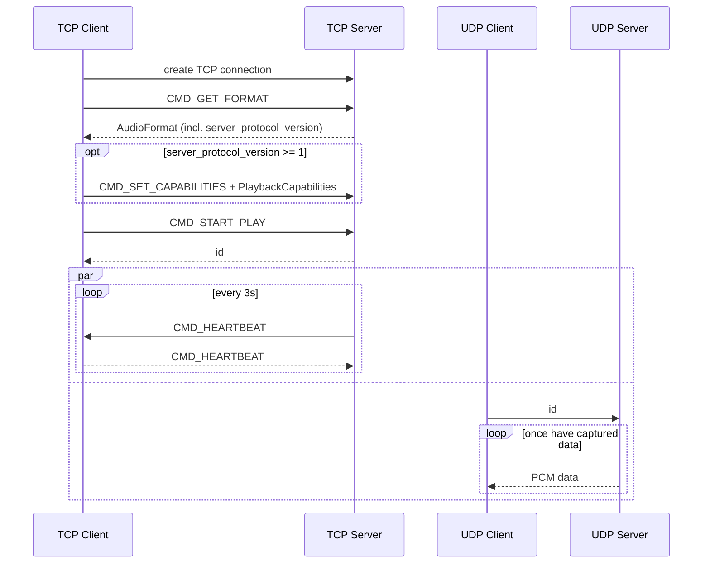

## Audio format compatibility

The server captures one shared format and broadcasts identical raw PCM to every
peer, so it cannot transcode per client. The **client** therefore performs the
authoritative format fallback: it maps the reported `AudioFormat` to a config its
`AudioTrack` can actually play (down-converting 24/32-bit PCM on API < 31,
downmixing channel layouts with no valid mask) and converts each incoming PCM
packet accordingly.

`CMD_SET_CAPABILITIES` is an **optional, backward-compatible** addition:

- `AudioFormat.server_protocol_version` (field 4) is `0`/absent on legacy
  servers and `>= 1` on servers that understand capabilities.
- Only when it is `>= 1` does the client send `CMD_SET_CAPABILITIES` followed by
  a length-prefixed `PlaybackCapabilities` (the same `cmd, size, bytes` framing
  as the format response). The server records it and logs an actionable
  diagnostic (e.g. recommending a capture `--encoding`); it does not change the
  shared stream.
- A new client talking to an old server simply never sends the command, and an
  old client never sends it either, so the main flow above is unchanged for all
  client/server version combinations.